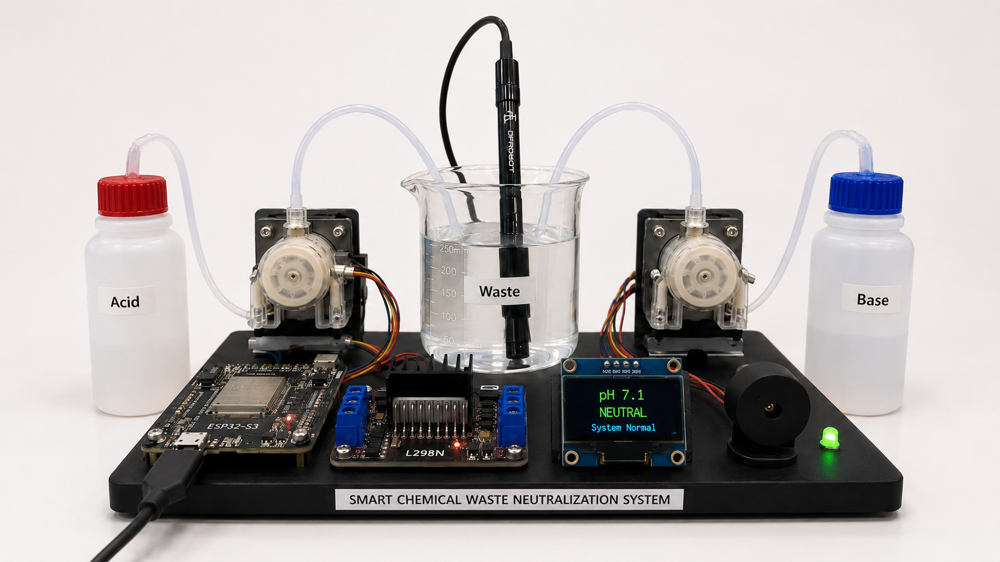
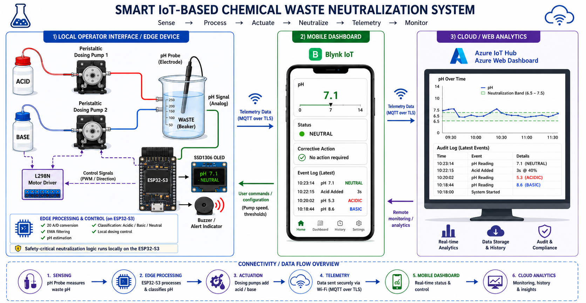
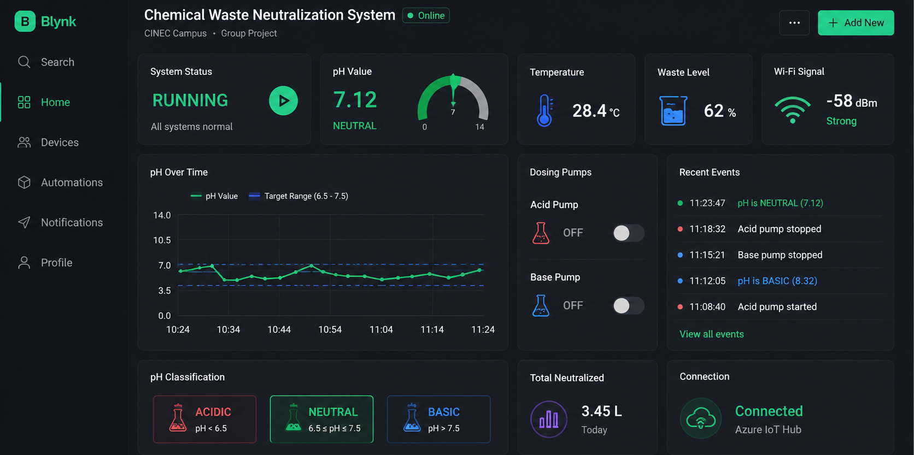

<h2 align="center">SMART IOT-BASED CHEMICAL WASTE pH NEUTRALIZATION SYSTEM</h2>

<p align="center"> This project monitors the pH levels of chemical waste in real-time and alerts operators when the waste reaches a neutral pH (safe for disposal). The system integrates with both Blynk IoT platform and Azure IoT Hub for comprehensive monitoring and data logging. </p>

<p align="center">
  
  <br>
  <em>Completed prototype of the Smart IoT-Based Chemical Waste Neutralisation System.</em>
</p>

### ➤ Key Features: 

- **Real-time pH Monitoring**: Continuous pH sensor readings with EMA filtering for stable measurements
- **Dual Cloud Integration**: Blynk IoT for mobile app monitoring and notifications | Azure IoT Hub for enterprise data logging
- **OLED Display**: Local 128x64 OLED display for immediate status visualization
- **Automated Alerts**: Visual alerts via LED indicator | Audio alerts via buzzer | Push notifications when waste becomes neutral
- **Live Dashboard**: Real-time pH charts | voltage readings, and statistics
- **Calibration Support**: Adjustable pH calibration parameters
- **Status Tracking**: Acidic/Basic/Neutral classification | Recommended neutralization actions | pH change detection and logging
<hr>
<h3 align="center">SYSTEM ARCHITECTURE</h2>
<p align="center">The system integrates pH sensing, edge processing, automated control, local
visualisation, and cloud connectivity through the ESP32-S3. </p>

<p align="center">
  
</p>

<p align="center">
  <em>Overall system architecture showing the interaction between sensing, edge processing, actuation, cloud services, and user interfaces.</em>
</p>

## ➤ Hardware Requirements

| Component | Specification | Pin Configuration |
|---|---|---|
| Microcontroller | ESP32-S3 DevKit C-1 | — |
| Display | SSD1306 128×64 OLED (I²C) | GPIO 8 (SDA), GPIO 9 (SCL) |
| pH Sensor | Analog pH sensor module (0–3.3V output) | ADC1_CH0 (GPIO 1) |
| Buzzer | 5V active buzzer | GPIO 18 |
| Power Supply | USB power (via ESP32) or external 5V | — |


## ➤ Software Requirements

- PlatformIO IDE or Arduino IDE
- ESP32 board support
- Libraries (auto-installed via platformio.ini):
  - Adafruit GFX Library
  - Adafruit SSD1306
  - Blynk IoT
  - Azure IoT Hub SDK
  - ArduinoJson
<hr>
<h3 align="center">BLYNK IOT DASHBOARD</h3>
<p align="center">The Blynk IoT dashboard provides remote monitoring and visualisation of
the system's operating status and sensor data. </p>

<p align="center">
  
</p>

<p align="center">
  <em>Blynk IoT dashboard displaying real-time pH measurements, voltage, system status, and monitoring data.</em>
</p>


<h3 align="center">DASHBOARD DATA</h3>

| **Virtual Pin** | V0 | V1 | V2 | V3 | V4 | V5 | V6 | V7–V8 | V9 | V10 |
|:---:|:---:|:---:|:---:|:---:|:---:|:---:|:---:|:---:|:---:|:---:|
| **Function** | pH value | Voltage reading | Current status | Recommended action | pH change count | Runtime | Neutral indicator | Calibration values | pH history | System logs |
<hr>

## ⚙️ Setup Instructions

### 1. Clone/Download the Project

```bash
git clone <your-repository-url>
cd ESP32-S3
```

### 2. Configure Credentials

Open `src/main.cpp` and update the following placeholders:

#### WiFi Credentials
```cpp
char ssid[] = "YOUR_SSID";           // Replace with your WiFi network name
char pass[] = "YOUR_PASSWORD";       // Replace with your WiFi password
```

#### Blynk Configuration
```cpp
#define BLYNK_TEMPLATE_ID "YOUR_BLYNK_TEMPLATE_ID"      // Get from Blynk Console
#define BLYNK_TEMPLATE_NAME "YOUR_TEMPLATE_NAME"
#define BLYNK_AUTH_TOKEN "YOUR_BLYNK_AUTH_TOKEN"        // Get from Blynk Mobile App
```

**How to get Blynk credentials:**
1. Create account at [blynk.cloud](https://blynk.cloud)
2. Create a new template and device
3. Copy Template ID and Auth Token from your device settings

#### Azure IoT Hub Configuration
```cpp
static const char* connectionString = "YOUR_AZURE_CONNECTION_STRING";
```

**Format:**
```
HostName=<your-hub>.azure-devices.net;DeviceId=<device-id>;SharedAccessKey=<key>
```

### 3. Configure Serial Port (PlatformIO)

Edit `platformio.ini` and set your COM port:

```ini
upload_port = COM7      ; Change to your ESP32's COM port
monitor_port = COM7
```

### 4. Install Dependencies

```bash
platformio lib install
```

Or use PlatformIO's automatic dependency installation.

### 5. Build and Upload

```bash
platformio run --target upload
```

Then open the serial monitor:
```bash
platformio device monitor
```

## 🔧 pH Sensor Calibration

The system uses two calibration parameters that must be adjusted for your specific sensor:

```cpp
#define PH_NEUTRAL_VOLTAGE 2.5    // Voltage at pH 7.0 (calibrate this!)
#define PH_VOLTAGE_SLOPE   0.17   // Voltage change per pH unit (typically 0.17-0.18)
```

### Calibration Steps

1. **Find Neutral Voltage**: 
   - Dip sensor in pH 7.0 buffer solution
   - Read the voltage output from serial monitor
   - Update `PH_NEUTRAL_VOLTAGE` with this value

2. **Find Voltage Slope**:
   - Test with pH 4.0 and pH 10.0 buffer solutions
   - Calculate: `slope = voltage_change / pH_change`
   - Update `PH_VOLTAGE_SLOPE` with this value

3. **Adjust Neutral pH Range** (optional):
   ```cpp
   float NEUTRAL_PH_MIN = 6.7;  // Lower acceptable pH
   float NEUTRAL_PH_MAX = 7.5;  // Upper acceptable pH
   ```

## 📱 Using the Blynk App

After setting up, download the Blynk mobile app and view:

- **V0**: pH value (Gauge widget)
- **V1**: Voltage reading
- **V2**: Current status (Acidic/Basic/Neutral)
- **V3**: Recommended action
- **V4**: pH change count
- **V5**: Runtime in minutes
- **V6**: Neutral indicator LED
- **V7-V8**: Calibration values
- **V9**: pH history chart
- **V10**: System logs (Terminal)

## 📊 Monitoring on Azure

Data is sent to Azure IoT Hub every 2 seconds. Monitor via:
- Azure Portal IoT Hub
- Custom dashboards
- Stream Analytics for real-time processing

## 🔌 Wiring Diagram

```
ESP32-S3
├── GPIO 8 (SDA) ──→ OLED SDA
├── GPIO 9 (SCL) ──→ OLED SCL
├── GPIO 1 (ADC) ──→ pH Sensor Out
├── GPIO 18      ──→ Buzzer +
├── GND          ──→ OLED GND, pH Sensor GND, Buzzer GND
└── 3.3V         ──→ OLED VDD, pH Sensor VDD

Note: All analog inputs are 3.3V max
```

## 📁 Project Structure

```
ESP32-S3/
├── src/
│   └── main.cpp              # Main application code
├── include/
│   └── README                # Include files directory
├── lib/
│   ├── Blynk/               # Blynk library
│   ├── BlynkESP8266_Lib/    # Blynk WiFi support
│   ├── Time/                # Time library
│   └── TinyGSM/             # GSM library
├── platformio.ini           # PlatformIO configuration
└── README.md               # This file
```

## 🚀 Troubleshooting

| Issue | Solution |
|-------|----------|
| OLED not detected | Check I2C connections (GPIO 8, 9). Verify SSD1306 I2C address (0x3C) |
| WiFi won't connect | Verify SSID and password. Check WiFi frequency (2.4GHz only) |
| pH readings unstable | Increase EMA filter alpha value or wait for sensor stabilization |
| Azure connection fails | Check connection string format. Verify device exists in IoT Hub |
| Blynk disconnects | Check WiFi stability. Restart device if needed |
| Incorrect pH values | Recalibrate using pH buffer solutions |

## 🔄 Data Flow

```
pH Sensor (ADC)
    ↓
EMA Filter (smoothing)
    ↓
pH Calculation (from voltage)
    ↓
Status Analysis (Acidic/Neutral/Basic)
    ↓
├──→ OLED Display (local)
├──→ Blynk Cloud (mobile app)
└──→ Azure IoT Hub (enterprise logging)
```

## 📝 Serial Output Example

```
Chemical Waste pH Monitoring System
with Blynk IoT + Azure IoT Hub Integration
===========================================

Connecting to Blynk...
Connected to Blynk Cloud!
Syncing time (NTP)...
Time synced: [timestamp]
=== Initializing Azure IoT Hub ===
Azure IoT Hub: Connected successfully!
System Ready!
Starting pH monitoring...

ADC: 2458  Voltage: 2.501 V  pH: 7.00  (NEUTRAL)
```

**Last Updated**: 2026-08-18
**Version**: 1.0  
**ESP32-S3 Chemical Waste Neutralization Monitoring System**
